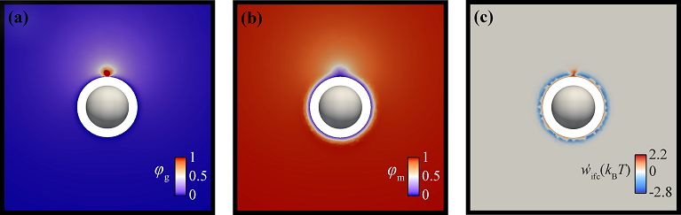

My name is Constantinos J. Revelas. Welcome to my GitHub webpage. 👋

# Personal Info
I am a Chemical Engineer and finishing PhD student in the field of Computational Materials Science.
I am currently affiliated in the School of Chemical Engineering of the National Techical University of Athens.
If interested, you can have a quick look at the website of my group, directed by Prof. Doros N. Theodorou: [CoMSE](https://comse.chemeng.ntua.gr/)

I am also a software Engineer by training and enthusiast of high permormance computing, scientific computing and investigation of
algorithm complexity.

I am proficient and mostly write code in:

# Interests/Background
- Computational Polymer Physics
- Design of Nanocomposite Materials
- Investigation of Thermodynamic Properties of Polymer Grafted Nanoparticles (PGNs)
- High Performance Computing
- Scientific Computing
- Numerical Analysis

# Research Output
- [Adressing Nanocomposite Systems via 3D-SCFT: Assessment of Smearing Approximation and Irregular Grafting Distributions (2023)](https://pubs.acs.org/doi/10.1021/acs.macromol.2c02474)
- [Solvation Free Energy of Dilute Grafted (Nano)Particles in Polymer Melts via the Self-Consistent Field Theory (2022)](https://pubs.acs.org/doi/pdf/10.1021/acs.jpcb.2c05306)
- [RuSseL: A Self-Consistent Field Theory Code for Inhomogeneous Polymer Interphases (2021)](https://www.mdpi.com/2079-3197/9/5/57)
- [Potential Of Mean Force between Bare or Grafted Silica/Polystyrene Surfaces from Self-Consistent Field Theory (2021)](https://www.mdpi.com/2073-4360/13/8/1197)
- [Stucture and Thermodynamics of Grafted Silica/Polystyrene Dilute Nanocomposites Investigated through Self-Consistent Field Theory (2021)](https://pubs.rsc.org/en/content/articlelanding/2021/sm/d1sm00078k)
- [A Three-Dimensional Finite Element Methodology for Addressing Heterogeneous Polymer Systems with Simulations Based on Self-Consistent Field Theory (2021)](https://aip.scitation.org/doi/abs/10.1063/5.0047729)
- [Phenol Hydrodeoxygenation over a Reduced and Sulfided NiMo/gamma-Alumina Catalyst (2019)](https://pubs.acs.org/doi/10.1021/acs.iecr.8b06465)

# Indicative Research Results
Apologies, this section is under construction..

Structural properties of chains grafted on solid surfaces

Thermodynamics of nanocomposite systems
